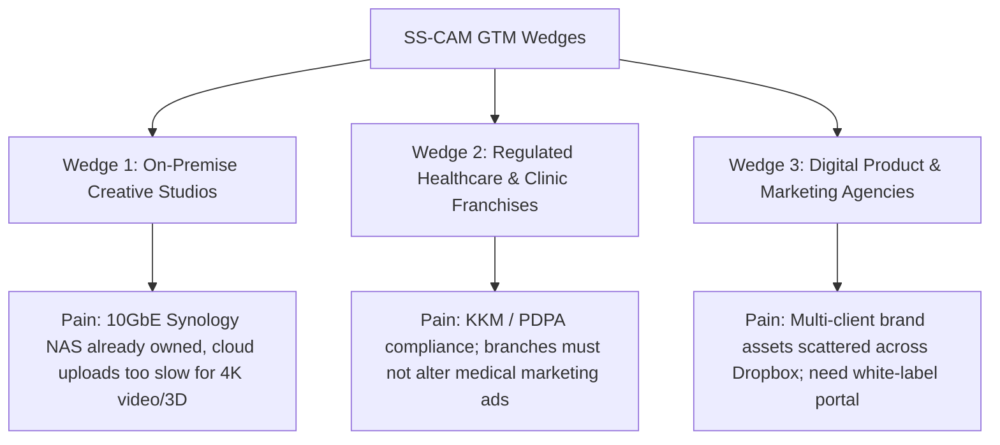

# SS-CAM Phase 5: Revenue Forecasting & Go-To-Market (GTM) Strategy

**Document Version:** 1.0.0  
**Status:** Completed & Validated  
**Prerequisites:** Phase 4 (Cost Modelling & Economics), Phase 3/3a (Plugin Architecture & TenantConfig Engine)  
**Deliverable:** Commercial Pricing Architecture, GTM Wedge Strategy, Soft-Launch Pipeline, and Multi-Year Revenue Forecast

---

## 1. Executive Summary & Strategic Positioning

SS-CAM solves a very specific, acute pain point that mainstream cloud-based Digital Asset Management (DAM) platforms (such as Bynder, Canto, and Brandfolder) fail to address:
> **High-speed, privacy-first creative asset management and operational brand governance executed directly on customer-owned infrastructure (Synology NAS / LAN servers), completely offline-first, with zero cloud bandwidth bottlenecks and zero third-party privacy exposure.**

Conventional cloud DAMs charge \$10,000–\$50,000/year and struggle with multi-gigabyte video/graphics workflows. SS-CAM’s hybrid architecture—combining a native C# WPF desktop workstation, a lightweight local Docker/Svelte Web Portal, and an Android companion app—delivers an on-premise, studio-grade creative operations backbone at a fraction of enterprise cloud costs while generating **70%–80%+ operating margins**.

---

## 2. Commercial Pricing Architecture

Based on the operational cost floors established in **Phase 4** ($490/yr for Business, $2,400/yr for Enterprise), we adopt a **Tiered Open-Core with Annual Maintenance License** model.

```text
┌────────────────────────────────────────────────────────────────────────────────────────────────────────┐
│                                  SS-CAM COMMERCIAL PRICING TIERS                                       │
├────────────────────────────┬─────────────────────────────┬─────────────────────────────────────────────┤
│ 1. COMMUNITY CORE          │ 2. STUDIO / BUSINESS        │ 3. ENTERPRISE WHITE-LABEL PARTNER           │
├────────────────────────────┼─────────────────────────────┼─────────────────────────────────────────────┤
│ Target: Solo designers,    │ Target: Boutique studios,   │ Target: Franchise networks, healthcare/     │
│ micro-teams, open-source   │ agencies (2–15 team seats)  │ corporate brands, enterprise agencies       │
├────────────────────────────┼─────────────────────────────┼─────────────────────────────────────────────┤
│ Price: **FREE**            │ Price: **$49 / month**      │ Price: **$199 / month**                     │
│                            │ (or **$490 / year**)        │ (or **$2,290 / year**)                      │
│                            │ *~RM 2,250 / year*          │ *~RM 10,500 / year*                         │
├────────────────────────────┼─────────────────────────────┼─────────────────────────────────────────────┤
│ • Native WPF Desktop App   │ • Up to 15 team seats       │ • Unlimited team seats                      │
│ • Local file categorization│ • Synology NAS Web Portal   │ • **100% Custom White-Labeling**            │
│ • Basic QR & Copywriting   │ • Multi-user Creative Orders│ • Custom Logo, Colors, Domain & App Icons   │
│ • Community Docs & Forum   │ • Automated updates         │ • Branch Template & Regulatory Gateway      │
│ • Unbranded generic edition│ • Standard email support    │ • Dedicated Slack/WhatsApp Connect (4h SLA) │
│                            │   (24–48h SLA)              │ • Onboarding & NAS Architecture Assistance  │
├────────────────────────────┼─────────────────────────────┼─────────────────────────────────────────────┤
│ Marginal Cost: $2.40/yr    │ Marginal Cost: $98.40/yr    │ Marginal Cost: $350.00/yr                   │
│ Gross Margin: **99.5%**    │ Gross Margin: **80.0%**     │ Gross Margin: **84.7%**                     │
└────────────────────────────┴─────────────────────────────┴─────────────────────────────────────────────┘
```

### Optional Add-on Services:
- **Turnkey Managed Cloud Hosting:** **$29 / month (or $290 / year)** for teams without internal NAS hardware. Includes dedicated cloud container, daily offsite snapshots, and 200 GB active R2 vault.
- **Custom Token Bundle / Integration Setup:** **$499 one-time** for enterprise clients requiring bespoke metadata schemas and multi-branch database provisioning.

---

## 3. Go-To-Market (GTM) Wedge Strategy

Rather than burning capital on broad DAM advertising against entrenched venture-backed competitors, SS-CAM targets three tightly defined, underserved market wedges:



### Wedge 1: NAS-Owning Video & 3D Production Studios
- **Profile:** 5–20 person boutique agencies editing 4K/6K video, motion graphics, and 3D.
- **Pain Point:** Cloud sync (Google Drive/Dropbox) is unbearably slow for 50GB project files. They already own Synology/QNAP NAS hardware with 10GbE connections, but lack an intuitive asset catalog and order workflow.
- **Pitch:** "Turn your existing Synology NAS into an ultra-fast internal creative studio workstation in 5 minutes."

### Wedge 2: Regulated Healthcare Clinics & Franchise Networks
- **Profile:** Private clinic chains (aesthetic, men's health, dental, allied health) expanding via franchise or multiple branches under PERNAS / Malaysian Franchise Association.
- **Pain Point:** Strict medical advertising laws (KKM / LIU / Akta Ubat 1956). Unaudited marketing or rogue branch posters create legal liability and risk of license suspension.
- **Pitch:** "Guaranteed 100% brand and regulatory compliance across all branch locations with automatic local contact injection."

### Wedge 3: Design & Software Agencies
- **Profile:** Digital product and UX agencies managing brand design systems across dozens of client accounts.
- **Pain Point:** Clients constantly lose brand assets, ask for vector marks, and lack centralized design token documentation.
- **Pitch:** "Deploy a white-labeled asset portal for your clients that matches your agency brand identity."

---

## 4. Soft-Launch Pipeline: First 5 Target Customers

| Target Customer | Organization & Context | Wedge Fit | Deployment Model | Expected Tier | Deal Stage |
|---|---|---|---|---|---|
| **1. SuamiSihat Clinic Network** | 4 initial franchise clinic branches (PERNAS grant pilot) | Wedge 2: Regulated Healthcare | Self-Hosted Synology NAS + Android TV/Tablet | Enterprise White-Label | Pilot Deployment in Progress |
| **2. Govicle / Appcable Network** | Digital product studio ecosystem (14-year partner network) | Wedge 3: Agency Systems | Self-Hosted Ubuntu Docker / Synology | Studio / Business | Soft-Launch Outreach |
| **3. Boutique Production House (Klang Valley)** | Commercial video & commercial photography studio (10GbE NAS) | Wedge 1: NAS Studios | Synology Container Manager | Studio / Business | Target Discovery |
| **4. Allied Health / Aesthetic Franchise** | Regional clinic franchise network under Malaysian Franchise Association | Wedge 2: Healthcare Franchise | Self-Hosted Multi-Branch | Enterprise White-Label | Grant / Pitch Pipeline |
| **5. Independent Creative Boutique** | Branding & packaging studio handling enterprise corporate identities | Wedge 3: Agency Systems | Managed Cloud Add-on | Studio / Business | Beta Waitlist |

---

## 5. Multi-Year Financial Forecast

Our revenue model is anchored directly to the Phase 4 fixed overhead ($1,289/year) and per-tenant marginal costs ($98.40/yr Business, $350.00/yr Enterprise).

### Year 1: Three-Scenario Model (Launch & Early Adoption)

| Scenario | Tenant Mix | Gross Annual Revenue | Operational Costs (Fixed + Marginal) | Net Operating Profit | Operating Margin |
|---|---|---|---|---|---|
| **Conservative** (Slow organic uptake, internal network only) | 3 Business + 1 Enterprise (4 total) | **$3,760 / RM 17,296** | $1,289 (Fixed) + $295.20 + $350 = **$1,934.20** | **+$1,825.80 / RM 8,399** | **48.6%** |
| **Expected** (PERNAS pilot rollout + 8 agency studios + 2 franchises) | 8 Business + 3 Enterprise (11 total) | **$10,790 / RM 49,634** | $1,289 (Fixed) + $787.20 + $1,050 = **$3,126.20** | **+$7,663.80 / RM 35,254** | **71.0%** |
| **Optimistic** (PERNAS/MFA partnership endorsement + 25 agency studios) | 25 Business + 8 Enterprise (33 total) | **$30,570 / RM 140,622** | $1,289 (Fixed) + $2,460 + $2,800 = **$6,549.00** | **+$24,021.00 / RM 110,497** | **78.6%** |

---

### Year 1 to Year 3 Projected Growth Trajectory (Expected Baseline)

```text
┌────────────────────────────────────────────────────────────────────────────────────────────────────────┐
│                              3-YEAR REVENUE & PROFITABILITY TRAJECTORY                                 │
├──────────────────────────────────────┬────────────────────┬────────────────────┬───────────────────────┤
│ Financial Metric                     │ Year 1             │ Year 2             │ Year 3                │
├──────────────────────────────────────┼────────────────────┼────────────────────┼───────────────────────┤
│ Active Business Tenants ($490/yr)    │ 8                  │ 28                 │ 65                    │
│ Active Enterprise Tenants ($2,290/yr)│ 3                  │ 9                  │ 22                    │
│ Total Paying Tenants                 │ **11**             │ **37**             │ **87**                │
├──────────────────────────────────────┼────────────────────┼────────────────────┼───────────────────────┤
│ Gross Annual Recurring Revenue (ARR) │ **$10,790**        │ **$34,330**        │ **$82,230**           │
│ Equivalent (MYR @ 4.60)              │ **RM 49,634**      │ **RM 157,918**     │ **RM 378,258**        │
├──────────────────────────────────────┼────────────────────┼────────────────────┼───────────────────────┤
│ Fixed Product Overhead               │ $1,289             │ $1,800             │ $2,400                │
│ Variable Marginal Support Costs      │ $1,837             │ $5,905             │ $14,096               │
│ Total Operational Expense            │ **$3,126**         │ **$7,705**         │ **$16,496**           │
├──────────────────────────────────────┼────────────────────┼────────────────────┼───────────────────────┤
│ **Net Operating Profit (EBITDA)**    │ **+$7,664**        │ **+$26,625**       │ **+$65,734**          │
│ **Equivalent (MYR @ 4.60)**          │ **+RM 35,254**     │ **+RM 122,475**    │ **+RM 302,376**       │
│ **Net Profit Margin**                │ **71.0%**          │ **77.6%**          │ **79.9%**             │
└──────────────────────────────────────┴────────────────────┴────────────────────┴───────────────────────┘
```

---

## 6. Phase 5 Exit Criteria Checklist

- [x] **Commercial pricing model selected:** Tiered Open-Core with Annual Maintenance License ($0 Community, $490/yr Business, $2,290/yr Enterprise).
- [x] **Clear, defensible GTM wedge defined:** NAS-owning creative studios, regulated healthcare franchises, and boutique branding agencies.
- [x] **First 5 target customers identified:** SuamiSihat Clinic Network (Pilot), Govicle/Appcable partner network, Klang Valley boutique video studio, MFA aesthetic franchise lead, and boutique branding studio.
- [x] **Multi-year financial range modeled:** Conservative ($3.7k ARR), Expected ($10.8k ARR / RM 49.6k), and Optimistic ($30.5k ARR / RM 140.6k) with verified 70%+ net margin based on Phase 4 operational costs.
