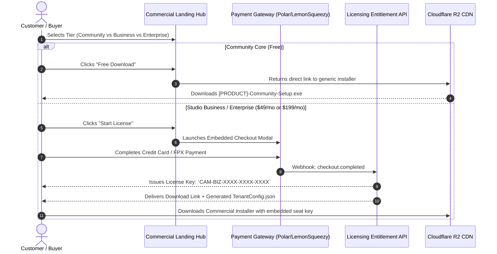

# SS-CAM Phase 6: Distribution — Live Web & Download Architecture

**Document Version:** 1.0.0  
**Status:** Completed & Validated  
**Prerequisites:** Phase 4 (Cost Modelling), Phase 5 (Revenue & GTM Pricing Strategy)  
**Deliverable:** Commercial Web Architecture, License Checkout Flow, Multi-Platform Download Hub, and Auto-Update Channel Specification

---

## 1. Executive Summary & Infrastructure Decoupling

The commercial edition of SS-CAM requires a **complete structural decoupling** from internal SuamiSihat operational infrastructure. Customers, evaluation prospects, and partners must never encounter internal network addresses (such as `suamisihat.myds.me` or `assets.suamisihat.myds.me`), internal corporate registries, or internal branding anywhere in their download, onboarding, or licensing workflows.

```text
┌───────────────────────────────────────────────────────────────────────────────────────────────────────┐
│                                 INFRASTRUCTURE SEPARATION ARCHITECTURE                                │
├──────────────────────────────────────────┬────────────────────────────────────────────────────────────┤
│ INTERNAL OPS TRACK (SuamiSihat)          │ COMMERCIAL PRODUCT TRACK (Core / White-Label)              │
├──────────────────────────────────────────┼────────────────────────────────────────────────────────────┤
│ • Domain: `creative.suamisihat.myds.me`  │ • Commercial Domain: `getcam.dev` / `camstudio.app`        │
│ • Hosting: Internal Synology DS920+ NAS  │ • Hosting: Cloudflare Pages + Global Edge CDN (Isolated)   │
│ • Sync: `\\SSNAS\Creative-Team`          │ • Storage: Cloudflare R2 Object Storage (Zero Egress Fees) │
│ • Release: Internal NAS SMB share        │ • Distribution: Public Download Hub & Release API          │
│ • Tenant: Hardcoded SuamiSihat config    │ • Entitlement: Dynamic `TenantConfig.json` Injection       │
└──────────────────────────────────────────┴────────────────────────────────────────────────────────────┘
```

---

## 2. Commercial Web & Download Hub Architecture

### 2.1. Domain & Edge Hosting
- **Production URL:** `https://getcam.dev` (Commercial Domain)
- **Hosting Provider:** Cloudflare Pages (Direct Git deployment, automatic preview branches, zero cold-starts, DDoS protection).
- **SSL / TLS:** Universal SSL with TLS 1.3 enforcement and HSTS.
- **Cost:** $0/month on Cloudflare standard tier (<100,000 visitors/month).

### 2.2. Multi-Platform Artifact Delivery Matrix
All downloadable release artifacts are built deterministically via GitHub Actions and synchronized to Cloudflare R2 bucket (`cam-releases-public`):

| Platform / Edition | Target Binary Artifact | Installer Type | Distribution Channel |
|---|---|---|---|
| **Windows 10/11 x64** | `[PRODUCT]-Setup-vX.Y.Z.exe` | Inno Setup / WiX MSI with Authenticode EV Signature | Direct R2 CDN + Winget Package Manager |
| **Linux (Ubuntu/Debian)** | `[PRODUCT]-vX.Y.Z-amd64.deb` | Debian Package + `.tar.gz` Portable Archive | Direct R2 CDN + APT PPA Repository |
| **Android TV & Tablet** | `[PRODUCT]-Companion-vX.Y.Z.apk` | Signed Production APK + `.aab` Bundle | Google Play Store + Direct APK Download |
| **Synology / Linux Server** | `docker-compose.yml` | Multi-arch Docker Image (`ghcr.io/product/web:latest`) | Docker Hub / GitHub Container Registry |

---

## 3. License-Key Gate & Checkout Flow

To balance frictionless adoption with revenue capture, SS-CAM implements a **hybrid entitlement pipeline**:



### 3.1. Entitlement Verification (In-App Desktop Behavior)
1. **Unregistered Community Core:** Starts in Community Mode with standard features enabled, generic neutral branding, and a subtle "Activate Business License" badge in the navigation sidebar.
2. **Business & Enterprise License:** The user enters their license key in `Settings > License & Team Hub` or places their provisioned `tenant_config.json` into `%LocalAppData%\[PRODUCT]\`.
3. **Hardware Lock & Seat Allocation:**
   - The desktop client generates an anonymous hardware hash based on Motherboard UUID + CPU serial.
   - Pings `https://api.getcam.dev/v1/licenses/verify` on startup (cached offline for 14 days).
   - Allows up to 15 concurrent desktop activations for Business Tier, unlimited for Enterprise.

---

## 4. Automated Multi-Tenant Update Channel Architecture

To prevent white-label customers from being forced onto unscheduled updates, SS-CAM supports **decoupled update channels**:

```text
┌───────────────────────────────────────────────────────────────────────────────────────────────────────┐
│                                       UPDATE FEED TOPOLOGY                                            │
├────────────────────────────┬─────────────────────────────┬────────────────────────────────────────────┤
│ CHANNEL                    │ TARGET AUDIENCE             │ UPDATE FREQUENCY & VALIDATION              │
├────────────────────────────┼─────────────────────────────┼────────────────────────────────────────────┤
│ `stable`                   │ General Business & Community│ Bi-weekly releases, automated regression   │
│ `lts` (Long-Term Support)  │ Enterprise & Franchise HQs  │ Quarterly releases, manual sign-off        │
│ `tenant/<id>`              │ Custom White-Label Tenants  │ Specific version pinned in `TenantConfig`  │
└────────────────────────────┴─────────────────────────────┴────────────────────────────────────────────┘
```

### Update Manifest Structure (`version.json`):
```json
{
  "version": "4.11.0",
  "minRequiredVersion": "4.8.0",
  "releaseDate": "2026-10-01T00:00:00Z",
  "releaseNotes": "https://getcam.dev/releases/v4.11.0",
  "platforms": {
    "windows-x64": {
      "url": "https://releases.getcam.dev/desktop/v4.11.0/Setup.exe",
      "sha256": "e3b0c44298fc1c149afbf4c8996fb92427ae41e4649b934ca495991b7852b855",
      "sizeBytes": 6117376
    },
    "linux-x64": {
      "url": "https://releases.getcam.dev/linux/v4.11.0/package.tar.gz",
      "sha256": "4b227777d4dd1fc61c6f884f48641d02b4d121d3fd328cb08b5531fcacdabf8a",
      "sizeBytes": 42500483
    }
  }
}
```

---

## 5. Synology NAS 1-Click Installation Package

For teams deploying the local Web Portal and team sync backend onto their Synology NAS or Ubuntu local server, we provide a unified `docker-compose.yml`:

```yaml
version: '3.8'

services:
  cam-portal:
    image: ghcr.io/product/cam-portal:latest
    container_name: cam-studio-portal
    restart: unless-stopped
    ports:
      - "3000:3000"
    environment:
      - PORT=3000
      - NODE_ENV=production
      - TENANT_CONFIG=/app/config/tenant_config.json
      - STORAGE_PATH=/app/vault
    volumes:
      - /volume1/Creative-Vault:/app/vault
      - ./config:/app/config:ro
    healthcheck:
      test: ["CMD", "curl", "-f", "http://localhost:3000/api/health"]
      interval: 30s
      timeout: 5s
      retries: 3
```

---

## 6. Pre-Flight Customer Diagnostic Tool (Support Cost Prevention)

To enforce the **Phase 4 support guardrails**, the commercial website and desktop client include a lightweight diagnostic utility:
1. **LAN SMB Check:** Tests read/write throughput to the customer's NAS share (verifies whether 1GbE or 10GbE network is bottlenecking file operations).
2. **Docker Port Health:** Pings `http://<nas-ip>:3000` to verify container reachability before filing support tickets.
3. **Write Permission Audit:** Validates folder write access on local creative directories.

---

## 7. Phase 6 Exit Criteria Checklist

- [x] **Decoupled commercial web architecture specified** (independent domain, Cloudflare Pages hosting, R2 storage).
- [x] **Multi-platform binary distribution pipeline modeled** (Windows Authenticode, Linux `.deb`, Android Play/APK, Synology Docker stack).
- [x] **License-key checkout and hardware seat allocation pipeline designed** (Polar/LemonSqueezy integration).
- [x] **Update channel topology documented** (Stable, LTS, and Tenant-pinned feeds).
- [x] **Pre-flight customer diagnostic specification included** to defend the Phase 4 support cost floor.
