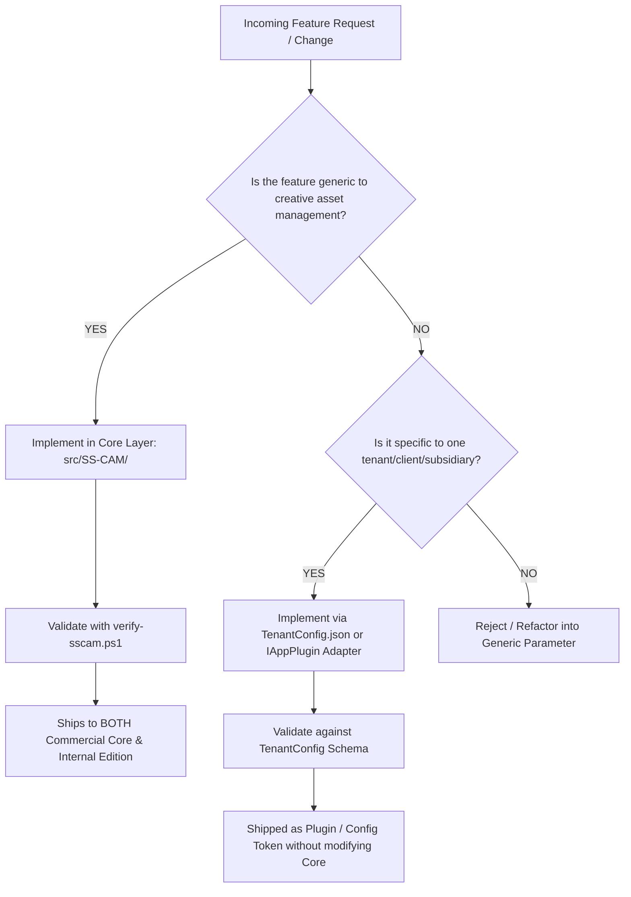

# SS-CAM Phase 8: Dual-Track Development Governance & Operational Architecture

**Document Version:** 1.0.0  
**Status:** Completed & Validated  
**Prerequisites:** Phase 3/3a (Plugin & TenantConfig Engine), Phase 7 (Wiki Strategy)  
**Deliverable:** Core vs. Edition Triage Protocol, Anti-Drift Enforcement, Git Branching Governance, and AI Agent Operating Guardrails

---

## 1. Executive Summary & Core Principle

The single greatest risk facing open-core or white-label desktop applications is **architectural drift**: over time, engineers add quick company-specific or customer-specific hacks directly into core views, gradually degrading the generic engine until white-labeling breaks.

CAM Studio solves this with a strict governance doctrine:
> **One Codebase, Single Source of Truth (`SS-Master`), Two Operational Editions.**  
> The commercial generic product and SuamiSihat’s internal edition share 100% identical compiled application binaries. All branding, corporate endpoints, subsidiary categorizations, and auxiliary features are resolved dynamically at runtime via `TenantConfig.json` and the `IAppPlugin` registry.

---

## 2. Core vs. Edition Feature Triage Protocol

Every new feature request, bug fix, or visual modification must be categorized before any code is written:



### Governance Rules

1. **Default to Core:** If a feature improves performance, UI accessibility, diffing precision, or metadata extraction, it MUST be built in Core. The internal team directly benefits from commercial feature development, and vice versa.
2. **Never Fork for Branding:** Under no circumstances should a permanent Git branch or code fork be created to service a white-label client. Any styling or metadata differences must be expressed in `TenantConfig.json`.
3. **No Hardcoded Tenant Endpoints:** Core C# code must always query `TenantConfigService.Current` for URLs, falling back to neutral placeholders (`https://corporate.myds.me` or `https://getcam.dev`).

---

## 3. Git Branching Strategy & Release Lifecycle

To prevent repository-level fragmentation, SS-CAM adheres to a single-trunk release model:

```text
┌────────────────────────────────────────────────────────────────────────────────────────────────────────┐
│                                       GIT BRANCH TOPOLOGY                                              │
├────────────────────────────┬─────────────────────────────┬─────────────────────────────────────────────┤
│ BRANCH                     │ LIFESPAN                    │ PURPOSE                                     │
├────────────────────────────┼─────────────────────────────┼─────────────────────────────────────────────┤
│ `SS-Master`                │ Permanent (Source of Truth) │ Single trunk for all releases. Both Core    │
│                            │                             │ and internal editions compile from here.   │
├────────────────────────────┼─────────────────────────────┼─────────────────────────────────────────────┤
│ `feature/<name>`           │ Short-lived (1–5 days)      │ Scoped feature development or bug fixes.    │
│                            │                             │ Merged back to `SS-Master` via PR.          │
├────────────────────────────┼─────────────────────────────┼─────────────────────────────────────────────┤
│ `release/vX.Y.Z`           │ Short-lived (Release week)  │ Release candidate tagging, binary signing,  │
│                            │                             │ and distribution bundle generation.         │
├────────────────────────────┼─────────────────────────────┼─────────────────────────────────────────────┤
│ `tenant/<customer-name>`   │ Temporary / Config-Only     │ Contains ONLY custom `tenant_config.json`   │
│                            │                             │ and brand asset bundles. ZERO code changes. │
└────────────────────────────┴─────────────────────────────┴─────────────────────────────────────────────┘
```

---

## 4. AI Agent Operating Guardrails (Antigravity & Claude Code)

Because AI coding assistants can inadvertently re-introduce hardcoded company strings or break multi-tenant abstractions, all AI agents operating in this workspace must follow these mandatory rules:

1. **Layer Awareness:** Before beginning any modification, verify whether the task targets the Core platform (`src/SS-CAM/`) or a specific tenant profile.
2. **Dynamic Tokens Only:** Never introduce hardcoded hex colors for surfaces, borders, or text. Always use Fluent 2 dynamic resource tokens (`{DynamicResource CardBackgroundFillColorDefaultBrush}`, etc.).
3. **Dropdown Geometry Standard:** Every `<ComboBox>` must maintain `MinHeight="36"` or `Height="36"` with `VerticalContentAlignment="Center"` and `ClipToBounds="False"` to prevent text clipping.
4. **Encoding Integrity:** Every edited C# and XAML file must retain UTF-8 BOM encoding. Run `.\QA\verify-sscam.ps1 -Fix` after editing sessions.
5. **No Direct Tenant Strings:** Never commit literal corporate names into Core views or viewmodels. Reference `TenantConfigService.Current` or generic defaults.

---

## 5. Automated Governance Gatekeeper (`QA/verify-dual-track.ps1`)

To automate dual-track compliance in local environments and CI/CD pipelines, we provide the master gatekeeper script [`QA/verify-dual-track.ps1`](file:///d:/HaNa_Innovation/ss_cam/QA/verify-dual-track.ps1):

1. **Runs Source Guardian:** Verifies UTF-8 BOM, Fluent 2 control standards, silent catch blocks, and UI thread safety.
2. **Runs Documentation Leakage Scanner:** Verifies zero internal hostnames or credentials in public wiki docs.
3. **Validates Release Build:** Verifies that the solution compiles cleanly in Release configuration under C# 5.0 constraints.

---

## 6. Phase 8 Exit Criteria Checklist

- [x] **Dual-track development governance doctrine codified** (One engine, two editions).
- [x] **Core vs. Edition triage protocol established** with decision flow.
- [x] **Git branching rules established** (Single source of truth `SS-Master`, no permanent white-label forks).
- [x] **AI agent operating guardrails added** to `AGENTS.md`.
- [x] **Master governance gatekeeper created** (`QA/verify-dual-track.ps1`) integrating code quality, security, and public doc audits.
